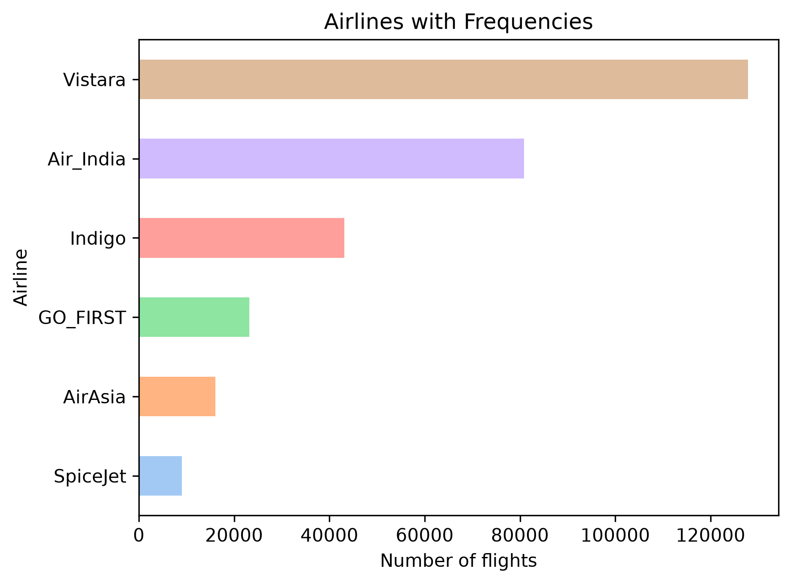
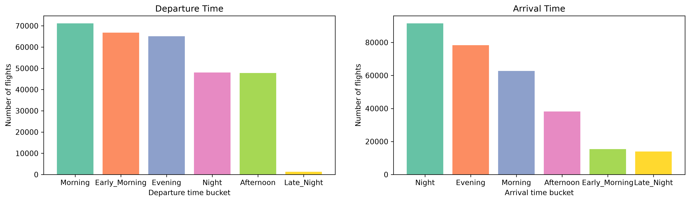
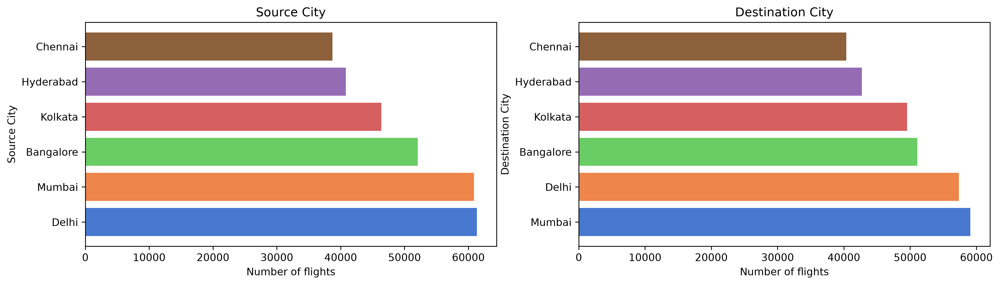
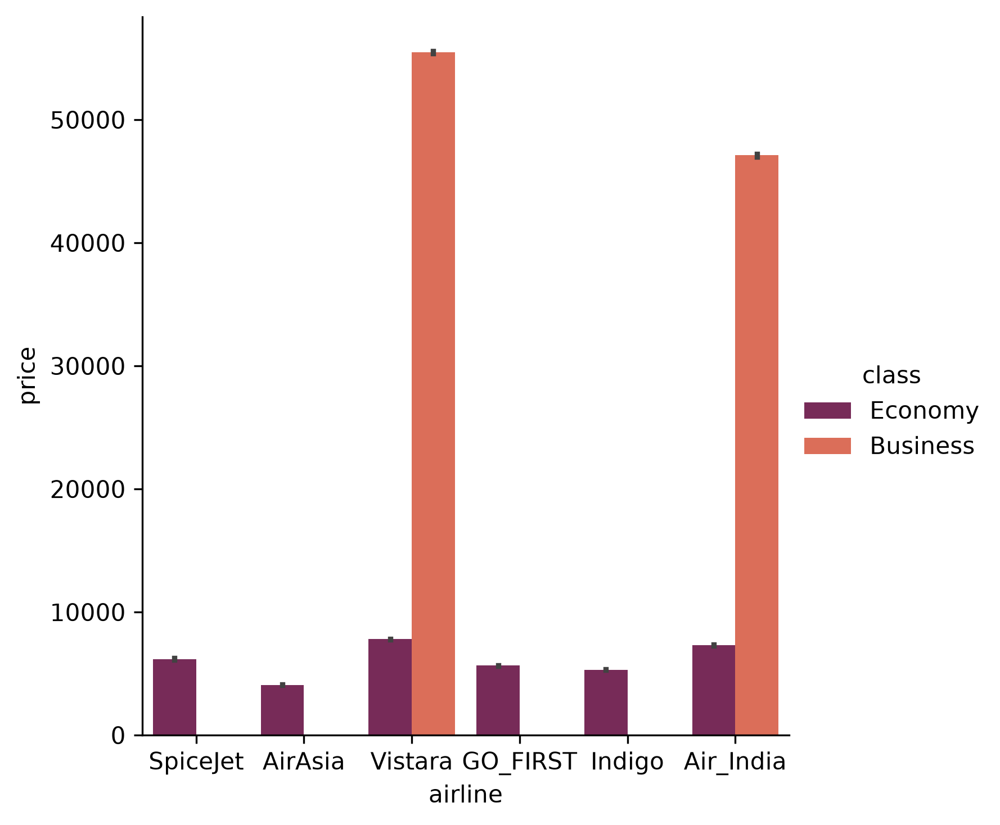
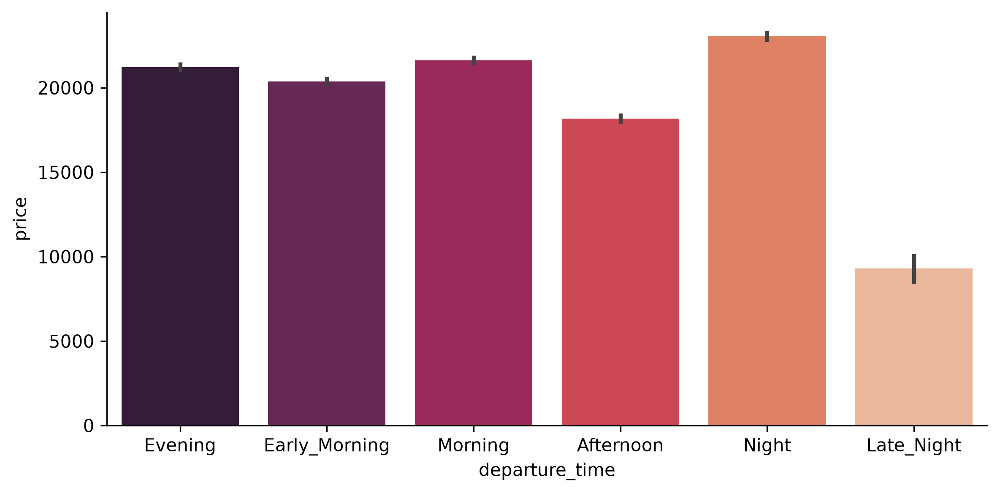
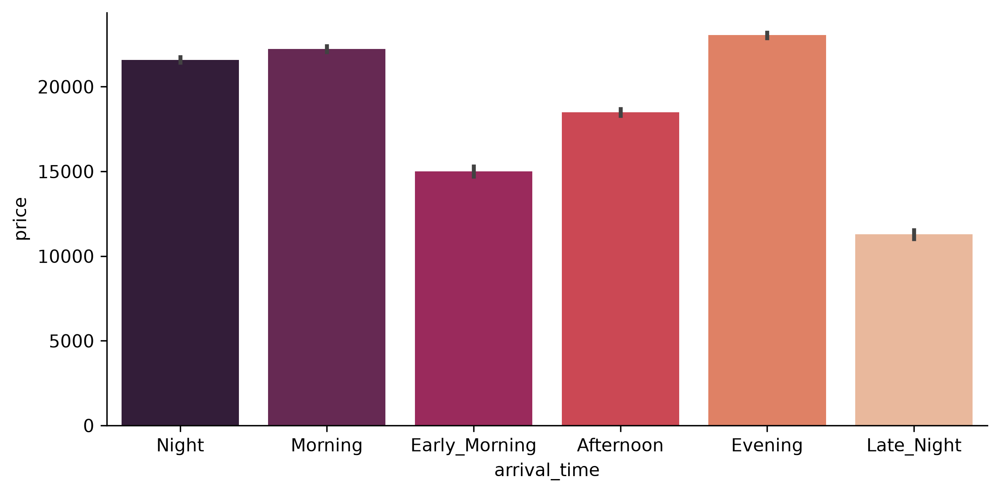
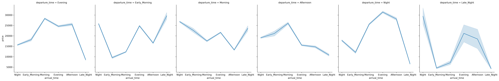
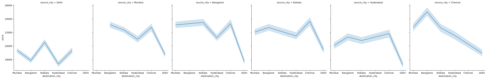
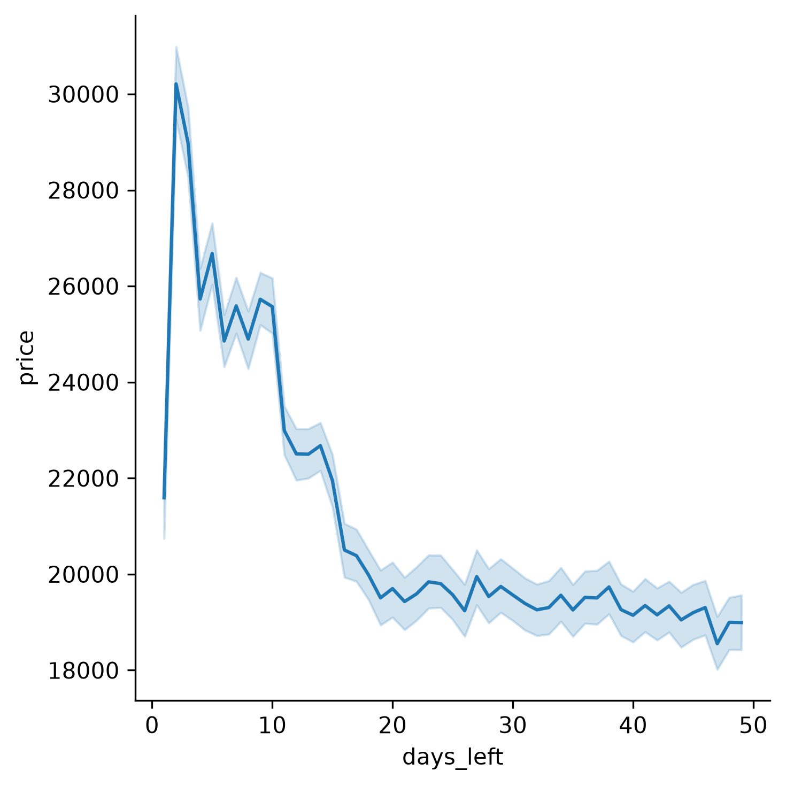
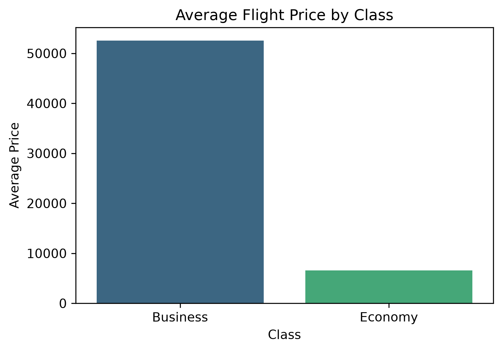

# ✈️ Flights Dataset Analysis — Exploratory Data Analysis

Exploratory Data Analysis on an Indian domestic flight booking dataset to uncover pricing patterns and trends across airlines, cities, timing, and ticket class.

## 📂 Dataset

- **File:** `airlines_flights_data.csv`
- **Rows:** 300K+ flight records
- **Airlines:** 6 (SpiceJet, AirAsia, Vistara, GO_FIRST, Indigo, Air India)
- **Cities:** 6 source/destination cities
- **Price Range:** ₹1,105 to ₹1,23,071
- **Key Columns:** Airline, Source City, Destination City, Departure Time, Arrival Time, Stops, Class, Days Left, Price

### Features

| Feature | Description |
|---|---|
| Airline | Airline company name (6 unique airlines) |
| Flight | Flight code of the aircraft |
| Source City | Departure city of the flight (6 unique cities) |
| Departure Time | Categorized into 6 time intervals |
| Stops | Number of stops between source and destination (3 values) |
| Arrival Time | Categorized into 6 time intervals |
| Destination City | Arrival city of the flight |

## 🛠️ Tools Used

- **NumPy** — Numerical operations
- **Pandas** — Data manipulation and cleaning
- **Matplotlib** — Core plotting
- **Seaborn** — Statistical visualizations

## 🧹 Data Cleaning

- Dropped the redundant `index` column
- Checked column dtypes and non-null counts
- Reviewed summary statistics for numeric columns
- Sanity-checked min/max values for duration and price
- Confirmed no missing values remained

## 📈 Analysis & Visualizations

### Analysis 1 — Airline Frequency Distribution
**Question:** What are the airlines in the dataset, accompanied by their frequencies?


### Analysis 2 — Departure & Arrival Time Distribution
**Question:** Show bar graphs representing the departure time & arrival time.


### Analysis 3 — Source & Destination City Distribution
**Question:** Show bar graphs representing the source city & destination city.


### Analysis 4 — Price Variation Across Airlines
**Question:** Does price vary with airlines?


### Analysis 5 — Price Variation by Departure & Arrival Time
**Question:** Does ticket price change based on the departure time and arrival time?




### Analysis 6 — Price Variation by Source & Destination
**Question:** How does the price change with change in source and destination?


### Analysis 7 — Price vs Days Left Before Departure
**Question:** How is the price affected when tickets are bought just 1 or 2 days before departure?


### Analysis 8 — Price by Ticket Class
**Question:** How does the ticket price vary between Economy and Business class?


### Analysis 9 — Vistara Delhi → Hyderabad Business Price
**Question:** What will be the average price of Vistara airline for a flight from Delhi to Hyderabad in Business class?

Filtered the dataset to Vistara, Business class, Delhi → Hyderabad routes and computed the average ticket price.

## 🚀 Getting Started

```bash
git clone <your-repo-url>
cd <repo-folder>
pip install numpy pandas matplotlib seaborn jupyter
jupyter notebook flights.ipynb
```

## 📁 Project Structure

```
.
├── flights.ipynb
├── airlines_flights_data.csv
├── images/
│   ├── q1_airline_frequency.png
│   ├── q2_departure_arrival_time.png
│   ├── q3_source_dest_city.png
│   ├── q4_price_by_airline.png
│   ├── q5a_price_departure_time.png
│   ├── q5b_price_arrival_time.png
│   ├── q5c_price_arrival_by_departure.png
│   ├── q6_price_source_dest.png
│   ├── q7_price_vs_days_left.png
│   └── q8_price_by_class.png
└── README.md
```
#
